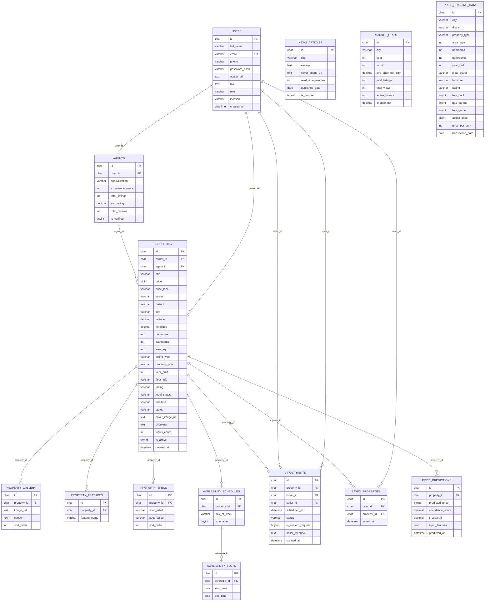

# 🏠 Database Schema — Real Estate Platform (MySQL)

> **Chuẩn:** 3NF · **RDBMS:** MySQL 8.0+ · **Ngày:** 02/03/2026

---

## ERD Diagram



---

## SQL DDL — MySQL 8.0+

```sql
-- Tạo database
CREATE DATABASE real_estate CHARACTER SET utf8mb4 COLLATE utf8mb4_unicode_ci;
USE real_estate;
```

### 1. `users`

```sql
CREATE TABLE users (
    id            CHAR(36)     PRIMARY KEY DEFAULT (UUID()),
    full_name     VARCHAR(100) NOT NULL,
    email         VARCHAR(255) NOT NULL UNIQUE,
    phone         VARCHAR(20),
    password_hash VARCHAR(255) NOT NULL,
    avatar_url    TEXT,
    bio           TEXT,
    role          VARCHAR(20)  NOT NULL DEFAULT 'buyer',
    location      VARCHAR(200),
    created_at    DATETIME     DEFAULT CURRENT_TIMESTAMP,
    CONSTRAINT chk_role CHECK (role IN ('buyer','seller','agent','admin'))
);
```

### 2. `agents`

```sql
CREATE TABLE agents (
    id               CHAR(36)       PRIMARY KEY DEFAULT (UUID()),
    user_id          CHAR(36)       NOT NULL UNIQUE,
    specialization   VARCHAR(200),
    experience_years TINYINT        DEFAULT 0,
    total_listings   INT            DEFAULT 0,
    avg_rating       DECIMAL(3,2)   DEFAULT 0.00,
    total_reviews    INT            DEFAULT 0,
    is_verified      TINYINT(1)     DEFAULT 0,
    FOREIGN KEY (user_id) REFERENCES users(id) ON DELETE CASCADE
);
```

### 3. `properties`

```sql
CREATE TABLE properties (
    id              CHAR(36)     PRIMARY KEY DEFAULT (UUID()),
    owner_id        CHAR(36)     NOT NULL,
    agent_id        CHAR(36),
    title           VARCHAR(300) NOT NULL,
    price           BIGINT,
    price_label     VARCHAR(100),
    street          VARCHAR(300),
    district        VARCHAR(150),
    city            VARCHAR(150) NOT NULL,
    latitude        DECIMAL(10,7),
    longitude       DECIMAL(10,7),
    bedrooms        TINYINT      DEFAULT 0,
    bathrooms       TINYINT      DEFAULT 0,
    area_sqm        INT,
    listing_type    VARCHAR(20)  DEFAULT 'For Sale',
    property_type   VARCHAR(50),
    year_built      SMALLINT,
    floor_info      VARCHAR(100),
    facing          VARCHAR(50),
    legal_status    VARCHAR(100),
    furniture       VARCHAR(100),
    status          VARCHAR(30)  DEFAULT 'active',
    cover_image_url TEXT,
    overview        TEXT,
    views_count     INT          DEFAULT 0,
    is_active       TINYINT(1)   DEFAULT 1,
    created_at      DATETIME     DEFAULT CURRENT_TIMESTAMP,
    FOREIGN KEY (owner_id)  REFERENCES users(id)  ON DELETE CASCADE,
    FOREIGN KEY (agent_id)  REFERENCES agents(id) ON DELETE SET NULL,
    CONSTRAINT chk_listing  CHECK (listing_type IN ('For Sale','For Rent')),
    CONSTRAINT chk_status   CHECK (status IN
        ('active','negotiating','sold','rented','inactive'))
);

CREATE INDEX idx_prop_city   ON properties(city, district);
CREATE INDEX idx_prop_filter ON properties(listing_type, property_type, bedrooms, status, is_active);
CREATE INDEX idx_prop_price  ON properties(price);
```

### 4. `property_gallery`

```sql
CREATE TABLE property_gallery (
    id          CHAR(36) PRIMARY KEY DEFAULT (UUID()),
    property_id CHAR(36) NOT NULL,
    image_url   TEXT     NOT NULL,
    caption     TEXT,
    sort_order  INT      DEFAULT 0,
    FOREIGN KEY (property_id) REFERENCES properties(id) ON DELETE CASCADE
);
```

### 5. `property_features`

```sql
CREATE TABLE property_features (
    id           CHAR(36)     PRIMARY KEY DEFAULT (UUID()),
    property_id  CHAR(36)     NOT NULL,
    feature_name VARCHAR(100) NOT NULL,
    FOREIGN KEY (property_id) REFERENCES properties(id) ON DELETE CASCADE,
    UNIQUE KEY uq_feat (property_id, feature_name)
);
```

### 6. `property_specs`

```sql
CREATE TABLE property_specs (
    id          CHAR(36)     PRIMARY KEY DEFAULT (UUID()),
    property_id CHAR(36)     NOT NULL,
    spec_label  VARCHAR(100) NOT NULL,
    spec_value  VARCHAR(255),
    sort_order  INT          DEFAULT 0,
    FOREIGN KEY (property_id) REFERENCES properties(id) ON DELETE CASCADE
);
```

### 7. `availability_schedules`

```sql
CREATE TABLE availability_schedules (
    id          CHAR(36)    PRIMARY KEY DEFAULT (UUID()),
    property_id CHAR(36)    NOT NULL,
    day_of_week VARCHAR(15) NOT NULL,
    is_enabled  TINYINT(1)  DEFAULT 1,
    FOREIGN KEY (property_id) REFERENCES properties(id) ON DELETE CASCADE,
    UNIQUE KEY uq_schedule (property_id, day_of_week),
    CONSTRAINT chk_day CHECK (day_of_week IN
        ('Monday','Tuesday','Wednesday','Thursday','Friday','Saturday','Sunday'))
);
```

### 8. `availability_slots`

```sql
CREATE TABLE availability_slots (
    id          CHAR(36) PRIMARY KEY DEFAULT (UUID()),
    schedule_id CHAR(36) NOT NULL,
    start_time  TIME     NOT NULL,
    end_time    TIME     NOT NULL,
    FOREIGN KEY (schedule_id) REFERENCES availability_schedules(id) ON DELETE CASCADE,
    CONSTRAINT chk_time CHECK (end_time > start_time)
);
```

### 9. `appointments`

```sql
CREATE TABLE appointments (
    id                CHAR(36)   PRIMARY KEY DEFAULT (UUID()),
    property_id       CHAR(36)   NOT NULL,
    buyer_id          CHAR(36)   NOT NULL,
    seller_id         CHAR(36)   NOT NULL,
    scheduled_at      DATETIME   NOT NULL,
    status            VARCHAR(30) DEFAULT 'pending',
    is_custom_request TINYINT(1)  DEFAULT 0,
    seller_feedback   TEXT,
    created_at        DATETIME   DEFAULT CURRENT_TIMESTAMP,
    FOREIGN KEY (property_id) REFERENCES properties(id)  ON DELETE CASCADE,
    FOREIGN KEY (buyer_id)    REFERENCES users(id)       ON DELETE CASCADE,
    FOREIGN KEY (seller_id)   REFERENCES users(id)       ON DELETE CASCADE,
    CONSTRAINT chk_appt_status CHECK (status IN
        ('pending','confirmed','denied','cancelled','completed','feedback_sent'))
);

CREATE INDEX idx_appt_buyer  ON appointments(buyer_id,  status);
CREATE INDEX idx_appt_seller ON appointments(seller_id, status);
```

### 10. `saved_properties`

```sql
CREATE TABLE saved_properties (
    id          CHAR(36) PRIMARY KEY DEFAULT (UUID()),
    user_id     CHAR(36) NOT NULL,
    property_id CHAR(36) NOT NULL,
    saved_at    DATETIME DEFAULT CURRENT_TIMESTAMP,
    FOREIGN KEY (user_id)     REFERENCES users(id)      ON DELETE CASCADE,
    FOREIGN KEY (property_id) REFERENCES properties(id) ON DELETE CASCADE,
    UNIQUE KEY uq_saved (user_id, property_id)
);
```

### 11. `news_articles`

```sql
CREATE TABLE news_articles (
    id                CHAR(36)    PRIMARY KEY DEFAULT (UUID()),
    title             VARCHAR(500) NOT NULL,
    excerpt           TEXT,
    cover_image_url   TEXT,
    read_time_minutes TINYINT     DEFAULT 5,
    published_date    DATE,
    is_featured       TINYINT(1)  DEFAULT 0
);
```

### 12. `market_stats`

```sql
CREATE TABLE market_stats (
    id                CHAR(36)      PRIMARY KEY DEFAULT (UUID()),
    city              VARCHAR(150)  NOT NULL,
    year              SMALLINT      NOT NULL,
    month             TINYINT       NOT NULL,
    avg_price_per_sqm DECIMAL(10,2),
    total_listings    INT           DEFAULT 0,
    total_views       INT           DEFAULT 0,
    active_buyers     INT           DEFAULT 0,
    change_pct        DECIMAL(6,3),
    UNIQUE KEY uq_stat (city, year, month),
    CONSTRAINT chk_month CHECK (month BETWEEN 1 AND 12)
);
```

### 13. `price_training_data`

```sql
CREATE TABLE price_training_data (
    id               CHAR(36)     PRIMARY KEY DEFAULT (UUID()),
    city             VARCHAR(150) NOT NULL,
    district         VARCHAR(150),
    property_type    VARCHAR(50),
    area_sqm         INT          NOT NULL,
    bedrooms         TINYINT      DEFAULT 0,
    bathrooms        TINYINT      DEFAULT 0,
    year_built       SMALLINT,
    legal_status     VARCHAR(100),
    furniture        VARCHAR(100),
    facing           VARCHAR(50),
    has_pool         TINYINT(1)   DEFAULT 0,
    has_garage       TINYINT(1)   DEFAULT 0,
    has_garden       TINYINT(1)   DEFAULT 0,
    actual_price     BIGINT       NOT NULL,
    price_per_sqm    INT          GENERATED ALWAYS AS (actual_price / area_sqm) STORED,
    transaction_date DATE,
    created_at       DATETIME     DEFAULT CURRENT_TIMESTAMP
);

CREATE INDEX idx_train_city ON price_training_data(city, district);
CREATE INDEX idx_train_area ON price_training_data(area_sqm, actual_price);
```

### 14. `price_predictions`

```sql
CREATE TABLE price_predictions (
    id               CHAR(36)     PRIMARY KEY DEFAULT (UUID()),
    property_id      CHAR(36),
    predicted_price  BIGINT       NOT NULL,
    confidence_score DECIMAL(5,4),
    r_squared        DECIMAL(6,5),
    input_features   JSON         NOT NULL,
    predicted_at     DATETIME     DEFAULT CURRENT_TIMESTAMP,
    FOREIGN KEY (property_id) REFERENCES properties(id) ON DELETE SET NULL
);
```

---

## Linear Regression — Công thức

```
Price = β₀
      + β₁ × area_sqm
      + β₂ × bedrooms
      + β₃ × bathrooms
      + β₄ × (2026 - year_built)    -- property_age
      + β₅ × city_hcmc              -- one-hot
      + β₆ × city_hanoi             -- one-hot
      + β₇ × type_villa             -- one-hot
      + β₈ × is_sohong              -- binary
      + β₉ × furniture_score        -- 0/1/2
      + β₁₀ × has_pool
      + β₁₁ × has_garage
      + β₁₂ × has_garden
      + ε
```

---

## Tổng kết

| # | Bảng | Mục đích |
|---|------|----------|
| 1 | `users` | Tài khoản |
| 2 | `agents` | Hồ sơ môi giới |
| 3 | `properties` | Tin đăng BĐS |
| 4 | `property_gallery` | Ảnh + caption |
| 5 | `property_features` | Tiện ích (pool, gym...) |
| 6 | `property_specs` | Thông số kỹ thuật |
| 7 | `availability_schedules` | Lịch xem nhà theo ngày |
| 8 | `availability_slots` | Khung giờ cụ thể |
| 9 | `appointments` | Lịch hẹn xem nhà |
| 10 | `saved_properties` | BĐS yêu thích ❤️ |
| 11 | `news_articles` | Tin tức thị trường |
| 12 | `market_stats` | Thống kê giá theo tháng |
| 13 | `price_training_data` | Dữ liệu train ML |
| 14 | `price_predictions` | Kết quả dự đoán giá |

**14 bảng · MySQL 8.0+ · utf8mb4**
